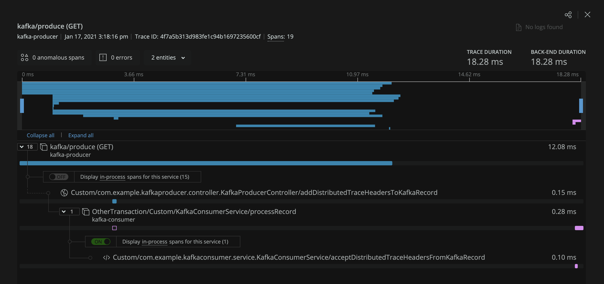

# New Relic Java agent distributing tracing API usage with Kafka  

This project demonstrates usage of the New Relic Java agent distributed tracing APIs. In this example, we use Java agent APIs to propagate 
[W3C Trace Context](https://www.w3.org/TR/trace-context/) headers (transported over Kafka records) between two SpringBoot services resulting in them being 
linked together in a distributed trace.

## How it works

### Kafka producer

The Java agent's [Spring instrumentation](https://github.com/newrelic/newrelic-java-agent/tree/main/instrumentation/spring-4.3.0) automatically starts a 
transaction when the `kafka/produce (GET)` controller route in the `kafka-producer` service is executed. This controller creates a Kafka record, generates W3C 
Trace Context headers and inserts them into a map of headers using the `insertDistributedTraceHeaders(Headers headers)` API, finally it manually retrieves the 
W3C headers and inserts them into the Kafka record headers before publishing the record to a Kafka broker. 

```java
    /**
     * This method illustrates usage of New Relic Java agent APIs for propagating distributed tracing headers over Kafka records.
     * NewRelic.getAgent().getTransaction().insertDistributedTraceHeaders(Headers) is used to generate distributed tracing headers and insert them into
     * a provided Headers map. This API generates a New Relic header (`newrelic`) as well as W3C Trace Context headers (`traceparent`, `tracestate`).
     *
     * @param producerRecord Kafka record
     */
    @Trace
    private void addDistributedTraceHeadersToKafkaRecord(ProducerRecord<String, String> producerRecord) {
        // ConcurrentHashMapHeaders provides a concrete implementation of com.newrelic.api.agent.Headers
        Headers distributedTraceHeaders = ConcurrentHashMapHeaders.build(HeaderType.MESSAGE);
        // Generate W3C Trace Context headers and insert them into the distributedTraceHeaders map
        NewRelic.getAgent().getTransaction().insertDistributedTraceHeaders(distributedTraceHeaders);

        // Retrieve the generated W3C Trace Context headers and insert them into the ProducerRecord headers
        if (distributedTraceHeaders.containsHeader(W3C_TRACE_PARENT)) {
            producerRecord.headers().add(W3C_TRACE_PARENT, distributedTraceHeaders.getHeader(W3C_TRACE_PARENT).getBytes(StandardCharsets.UTF_8));
        }

        if (distributedTraceHeaders.containsHeader(W3C_TRACE_STATE)) {
            producerRecord.headers().add(W3C_TRACE_STATE, distributedTraceHeaders.getHeader(W3C_TRACE_STATE).getBytes(StandardCharsets.UTF_8));
        }
    }
```

Additionally, the agent's [Kafka client instrumentation](https://github.com/newrelic/newrelic-java-agent/tree/main/instrumentation/kafka-clients-spans-0.11.0.0) 
automatically applies to the Kafka producer client and generates a span named `MessageBroker/Kafka/Topic/Produce/Named/example-topic` that is included in the 
distributed trace. The Kafka client instrumentation also injects the `newrelic` distributed tracing header into each record to link distributed 
traces with other services monitored by New Relic APM agents.

The `kafka-producer` service logs a line similar to the following each time it publishes a Kafka record to the broker:

```
Published Kafka Record:
	topic = example-topic, key = example-key-935, value = example-value-935
``` 

### Kafka consumer

The `kafka-consumer` service continuously polls the Kafka broker and individually processes each record that is retrieved. When the method that processes each 
record is executed a transaction is started using the Java agent's custom instrumentation APIs. During the processing W3C Trace Context headers are accessed 
from each record and passed to the `acceptDistributedTraceHeaders(TransportType transportType, Headers headers)` API which links the transaction to the 
distributed trace that originated in the `kafka-producer` service.

```java
    /**
     * This method illustrates usage of New Relic Java agent APIs for propagating distributed tracing headers over Kafka records.
     * NewRelic.getAgent().getTransaction().acceptDistributedTraceHeaders(TransportType, Headers) is used to accept distributed tracing headers from an
     * incoming request and link the requests together into a single distributed trace.
     *
     * @param record Kafka record
     */
    @Trace
    private static void acceptDistributedTraceHeadersFromKafkaRecord(ConsumerRecord<String, String> record) {
        // ConcurrentHashMapHeaders provides a concrete implementation of com.newrelic.api.agent.Headers
        Headers distributedTraceHeaders = ConcurrentHashMapHeaders.build(HeaderType.MESSAGE);

        // Iterate through each Kafka record header and insert the W3C Trace Context headers into the distributedTraceHeaders map
        for (Header kafkaRecordHeader : record.headers()) {
            String kafkaRecordHeaderValue = new String(kafkaRecordHeader.value(), StandardCharsets.UTF_8);
            System.out.printf("\tKafka record header: key = %s, value = %s%n", kafkaRecordHeader.key(), kafkaRecordHeaderValue);

            if (kafkaRecordHeader.key().equals(NEWRELIC_HEADER)) {
                distributedTraceHeaders.addHeader(NEWRELIC_HEADER, kafkaRecordHeaderValue);
            }

            if (kafkaRecordHeader.key().equals(W3C_TRACE_PARENT_HEADER)) {
                distributedTraceHeaders.addHeader(W3C_TRACE_PARENT_HEADER, kafkaRecordHeaderValue);
            }

            if (kafkaRecordHeader.key().equals(W3C_TRACE_STATE_HEADER)) {
                distributedTraceHeaders.addHeader(W3C_TRACE_STATE_HEADER, kafkaRecordHeaderValue);
            }

            // Accept distributed tracing headers to link this request to the originating request
            NewRelic.getAgent().getTransaction().acceptDistributedTraceHeaders(TransportType.Kafka, distributedTraceHeaders);
        }
    }
```

The `kafka-consumer` service logs a line similar to the following each time it processes a Kafka record:

```
Consuming Kafka Record:
	topic = example-topic, key = example-key-935, value = example-value-935, offset = 865
	Kafka record header: key = traceparent, value = 00-025be10f5f64e6ee009e3d0df7e8c474-128bc7290a7f5d8e-00
	Kafka record header: key = tracestate, value = 1939595@nr=0-0-2212864-1279685854-128bc7290a7f5d8e-f6b1ebb08dac2b50-0-0.916613-1610924459792
	Kafka record header: key = newrelic, value = {"d":{"ac":"2212864","pr":0.916613,"tx":"f6b1ebb08dac2b50","ti":1610924459797,"ty":"App","tk":"1939595","tr":"025be10f5f64e6ee009e3d0df7e8c474","sa":false,"ap":"1279685854"},"v":[0,1]}
``` 
### Example distributed trace

In this screenshot the `kafka-producer` and `kafka-consumer` services are connected in a single distributed trace.



## Build

Requires Java 8+  

To build all artifacts run the following from the project root:  
`./gradlew clean build`

Artifacts produced:
* `kafka-examples/kafka-producer/build/libs/kafka-producer-0.0.1-SNAPSHOT.jar`
* `kafka-examples/kafka-consumer/build/libs/kafka-consumer-0.0.1-SNAPSHOT.jar`

## Usage

A number of scripts have been provided in the `kafka_2.13-2.6.0/` directory to streamline running Kafka. 

1. Start zookeeper in its own terminal window:  
   `./start-zookeeper.sh`
2. Start the Kafka broker in its own terminal window:  
    `./start-kafka.sh`
3. Create a topic on the Kafka broker in new terminal window:  
    `./create-topic.sh`
4. [Run the Kafka producer and consumer services](#run-the-kafka-producer-and-consumer-services)
    * `KafkaProducerApplication`
    * `KafkaConsumerApplication`
5. Publish records to topic on the Kafka broker via one of the following options:  
    * Directly execute the route (publishes a single record each time): http://localhost:8080/kafka/produce
    * Run `./produce-records.sh` in its own terminal window to batch `curl` the route

## Run the Kafka producer and consumer services

### Configure the New Relic Java agent

Each service has its own `newrelic` directory containing the agent jar, agent api jar, and agent config yaml file:
* `/path/to/kafka-examples/kafka-producer/newrelic/`
* `/path/to/kafka-examples/kafka-consumer/newrelic/`

In order to report data to your New Relic account you are required to configure your `license_key` in the `newrelic.yml` or via 
the environment variable `NEW_RELIC_LICENSE_KEY` for each service.

The following config to enable 
[distributed tracing for kafka](https://docs.newrelic.com/docs/agents/java-agent/instrumentation/java-agent-instrument-kafka-message-queues),
 has already been added to the `newrelic.yml` file for each service:
 
```
common: &default_settings

  license_key: 'key'

...
  distributed_tracing:
    enabled: true

  class_transformer:
    kafka-clients-spans:
      enabled: true
...
```

### Run services with the New Relic Java agent

Once each service has a configured license key you can start both of the services as follows:

`kafka-producer` (runs on port `8080`):
* `java -javaagent:/path/to/kafka-examples/kafka-producer/newrelic/newrelic.jar -jar /path/to/kafka-examples/kafka-producer/build/libs/kafka-producer-0.0.1-SNAPSHOT.jar`

`kafka-consumer` (runs on port `8081`):
* `java -javaagent:/path/to/kafka-examples/kafka-consumer/newrelic/newrelic.jar -jar /path/to/kafka-examples/kafka-consumer/build/libs/kafka-consumer-0.0.1-SNAPSHOT.jar`

This will result in two services reporting to New Relic One: `kafka-producer` and `kafka-consumer`
