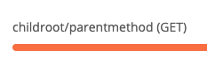
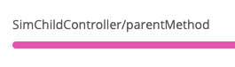
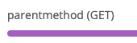

# Base Controller Example

## New Relic Agent Spring controller annotation instrumentation

The instrumentation assumes that Spring controllers are annotated with `@Controller` or `@RestController`.
The class can optionally be annotated with `@RequestMapping` and that path will be used at root of all other
URIs.  The methods that define mappings are annotated with `@RequestMapping` or HTTP method appropriate annotations.

Main class for contemporary
[Spring Controller Instrumentation](https://github.com/newrelic/newrelic-java-agent/blob/main/instrumentation/spring-4.3.0/src/main/java/com/nr/agent/instrumentation/SpringController_Instrumentation.java)

## Build Run Test Example

Adjust `run.sh` to reflect your New Relic JAR/config/environment then run it.

Then run `runXxxTests.sh` to hit the `composed`, `inherited` or `inherited2` endpoints to see the behavior.

If shared controller functionality is pulled out and used via `composition` the transactions
will appear as expected.

If they are inherited, transaction naming mechanism will not work correctly.

PLEASE NOTE: If `inherited` endpoints are hit first directly after startup, it will potentially cause issues
with the `composed` endpoints as they cause problems with the internal workings of the New Relic Agent's
Spring controller annotation functionality.

## Desired functionality

Based on a root path from `@RestController("/childroot")` and an inherited parent method
annotated with `@GetMapping("/parentmethod")` (where 'Get' could be Post, Put or Delete) the transaction name
for GET requests to `.../childroot/parentmethod` would be `childroot/parentmethod (GET)`.



However, the instrumentation does not currently expect the inheritance of routes and diplays the route as
`<ChildControllerClassName>/<parentMethodName>`



A quick workaround is to add `@RestController("/arbitraryrootpathforuniqueness")` to the parent controller class.
This prevents causing disruptions with other endpoint transaction names in the instrumentation and gives
a transaction name that is closer to the desired one `parentmethod (GET)` that at least includes the path
specified in the parent controller AND the HTTP method used for the request.



To fully achieve the desired transaction name and avoid unexpected results, the inheritance must be removed
and shared functionality used via composition.  This will achieve the most desirable results.

## Parent controller example with issue

Two `XxxChildController` classes inherit a root `GET` mapping in the `...inheritance` package.

```
curl http://localhost:8080/inherited/v1
curl http://localhost:8080/inherited/v2
```

This exhibits unfavorable behavior of transactions names that do not include HTTP method and
can negatively impact transaction names of the other endpoints.


## Workaround with annotated parent controller example

Same as above but the parent controller is annotated with `@RestController` and an arbitrary root pat is added.

```
curl http://localhost:8080/inherited2/v1
curl http://localhost:8080/inherited2/v2
```


## Controllers sharing functionality via composition

Two `Version#Controller` classes each have a root `GET` mapping in the `...composition` package.

```
curl http://localhost:8080/composed/v1
curl http://localhost:8080/composed/v2
```


The shared functionality has been refactored into a separate utility class `GetStuffAndDoThingsService`

## History

In early days of the Spring Framework the way you make a "controller" was to extend a Spring base controller class.

As this was found to be prohibitive and more designs increasingly chose to *Favor composition over inheritance* they began to use annotations.

*Favor composition over inheritance* is `Item 18` in Joshua Bloch's book *Effective Java, Third Edition*