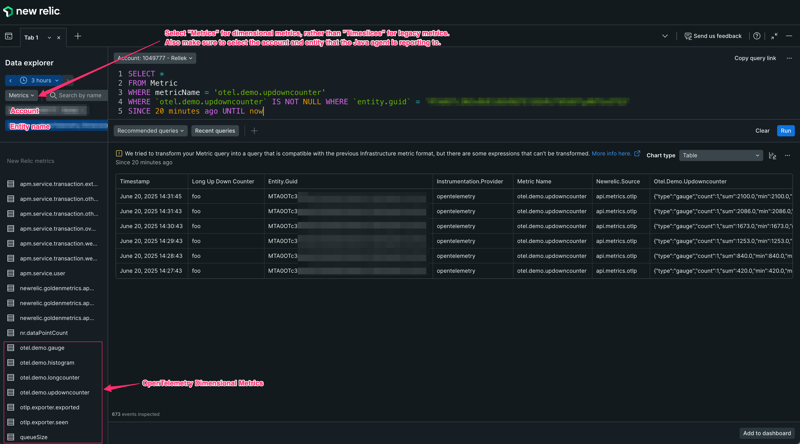

# OpenTelemetry Dimensional Metric With The New Relic Java Agent

This project demonstrates how to report dimensional metrics using the OpenTelemetry metrics APIs with the New Relic Java agent. The Java agent will instrument the [io.opentelemetry:opentelemetry-sdk-extension-autoconfigure](https://github.com/newrelic/newrelic-java-agent/tree/main/instrumentation/opentelemetry-sdk-extension-autoconfigure-1.28.0) dependency to configure the OpenTelemetry SDK to send dimensional metrics to New Relic. The instrumentation will also decorate the dimensional metric data with an `entity.guid` so that the data is reported to the same APM entity that the agent is reporting to.

## Requirements

### Java

This project requires Java 11 or higher

### Java Agent

This functionality will only work with Java agent 8.11.0 or higher.

### OpenTelemetry

This functionality will only work with `io.opentelemetry:opentelemetry-sdk-extension-autoconfigure` version `1.17.0-alpha` or higher.

To use this functionality, the following OpenTelemetry dependencies are required:

```groovy
    implementation(platform("io.opentelemetry:opentelemetry-bom:1.51.0"))
    implementation("io.opentelemetry:opentelemetry-sdk-extension-autoconfigure")
    implementation("io.opentelemetry:opentelemetry-api")
    implementation("io.opentelemetry:opentelemetry-exporter-otlp")
```

## Configuration

The following [configuration](https://docs.newrelic.com/docs/apm/agents/java-agent/configuration/java-agent-configuration-config-file/#otel-sdk-autoconfiguration) options are required for sending OpenTelemetry dimensional metrics to New Relic using the APM Java agent.  

```
-javaagent:/full/path/to/opentelemetry-dimensional-metric-api-example/newrelic/newrelic.jar
-Dopentelemetry.sdk.autoconfigure.enabled=true
-Dotel.java.global-autoconfigure.enabled=true
```

Note, if you are following along and wish to run the demo yourself, you can add your own ingest [license_key](https://docs.newrelic.com/docs/apis/intro-apis/new-relic-api-keys/#license-key) to the `newrelic.yml` file found in the `opentelemetry-dimensional-metric-api-example/newrelic/` directory of this project. You will also find the Java agent `newrelic.jar` file located there. By default, the Java agent will send data to a US Production data center, but you can change that by configuring `-Dnewrelic.environment=<environment>` to use one of the other environments defined in the `newrelic.yml` file.

## Build and Run The Demo

From the project root, create an executable jar:
```commandline
./gradlew shadowJar
```

From the project root, run the executable jar (entering the correct path to the `newrelic.jar`):

```commandline
java -javaagent:/full/path/to/opentelemetry-dimensional-metric-api-example/newrelic/newrelic.jar \
-Dotel.java.global-autoconfigure.enabled=true \
-Dopentelemetry.sdk.autoconfigure.enabled=true \
-jar build/libs/opentelemetry-dimensional-metric-api-example-1.0-SNAPSHOT-all.jar
```

## Caveats

### Triggering The Autoconfigure Instrumentation
If you don't set `-Dotel.java.global-autoconfigure.enabled=true` then it will not report OpenTelemetry dimensional metrics to New Relic and a message such as the following may be logged:

```
INFO: AutoConfiguredOpenTelemetrySdk found on classpath but automatic configuration is disabled. To enable, run your JVM with -Dotel.java.global-autoconfigure.enabled=true
```

Alternatively, programmatically calling `AutoConfiguredOpenTelemetrySdk.initialize().getOpenTelemetrySdk()` will have the same effect as setting `-Dotel.java.global-autoconfigure.enabled=true`.

### OpenTelemetry Metrics Exporter

By default, the OpenTelemetry [Metrics Exporter](https://opentelemetry.io/docs/specs/otel/metrics/sdk_exporters/otlp/) will be set to [otlp](https://opentelemetry.io/docs/specs/otel/configuration/sdk-environment-variables/#exporter-selection), which is what is required for the functionality described in this demo to work. If the exporter was changed to a different option (e.g. `-Dotel.metrics.exporter=console`) then the dimensional metrics would not be sent to New Relic.

### Ingest Host

Note that the dimensional metrics will be sent to the same ingest host that the Java agent is configured to use and this should not be changed.

## Visualizing Dimensional Metrics

If all goes well, then any dimensional metrics generated with the OpenTelemetry APIs will be associated with the account and entity that the APM Java agent is reporting to. You can view dimensional metrics in the New Relic Data Explorer by selecting "Metrics" as the data type and specifying the correct account and entity name. You should see something like the following:

