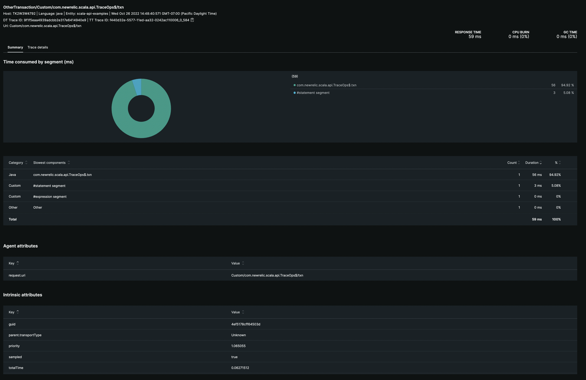

# New Relic Agent Custom Instrumentation Scala API

This is a contrived example that shows how you can use the Scala API to start a transaction and also trace segments of code and associate them as part of the Transaction.
Segments might be used to record time that may not cleanly be represented by a single function, for example the time between submitting something to be executed and when it is actually executed.
The goal of these examples is simply to demonstrate usage.  This particular example starts a Transaction and creates two separate segments that will be traced as components of the Transaction. 
You can create traces as statements or expressions. Both options are depicted.

## Set up

For simplicity, this project does not require the use of a `newrelic.yml` file.  The .jvmopts has system properties that will provide the minimum config (along with agent defaults) that is needed to report to New Relic.
You will need to add your `license_key` to the argument in `.jvmopts`

`-Dnewrelic.config.license_key=your-license-key`

Download the latest or appropriate Java Agent, aka `newrelic.jar`

With `.jvmopts` set appropriately, you won't need the `newrelic` folder and files, however, if you are familiar with that setup you can certainly go that route instead.
As always, the java agent just needs to be pasted as an argument to the Java process with the required configuration in some way (i.e. license key).

To run the app:

`sbt run`

Navigate to the New Relic UI for the App Name defined in configuration.

Select one of the Transaction Traces:

