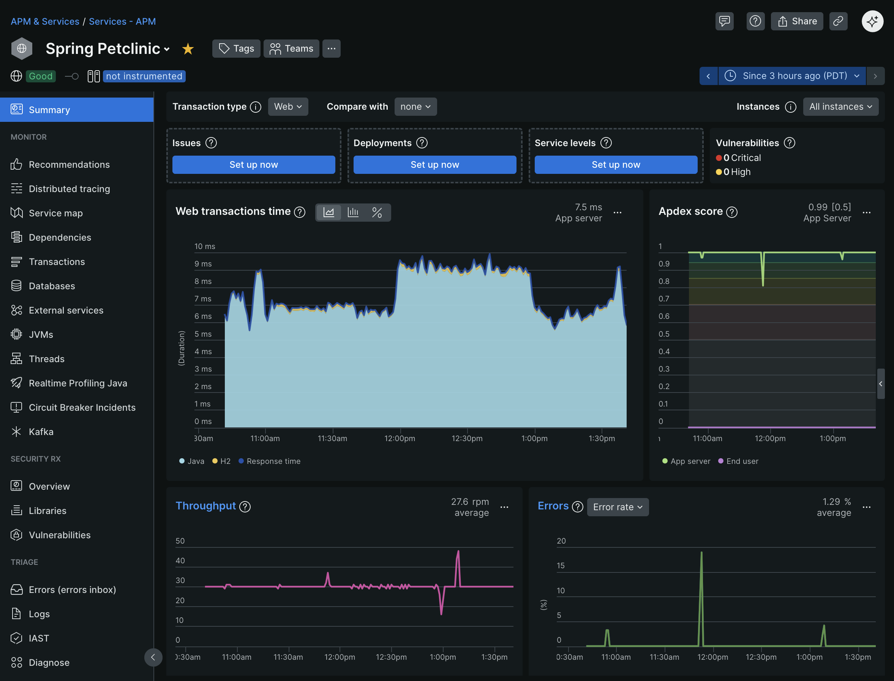

# Introduction to the New Relic APM Java Agent

New Relic [Application Performance Monitoring](https://docs.newrelic.com/docs/apm/new-relic-apm/getting-started/introduction-apm/) (APM) consists of telemetry gathering agents and a cloud-based (SaaS) observability platform for analyzing the captured telemetry. New Relic APM provides the flexibility to monitor the exact things that are critical to keeping mission-critical software running in a performant and correct manner.

In this tutorial, we will walk through the process of setting up a Spring PetClinic Java application and monitoring it with the New Relic Java agent. The New Relic Java agent monitors the JVM that an application is running within and gathers telemetry data that provides useful insights into JVM resource utilization and code-level performance. The New Relic Java agent ships with out-of-the-box instrumentation for many popular libraries and frameworks in addition to providing APIs for custom instrumenting business logic not supported out-of-the-box. 

Upon completion of this tutorial, we will have a locally running Java application that is being monitored by the New Relic Java agent and reporting telemetry to the New Relic cloud-based (SaaS) observability platform.

## Prerequisites

* New Relic APM account
* git
* terminal
* Java 17+ runtime
* IDE

## Getting Set Up

As long as the above prerequisites are met, it doesn't really matter how you go about setting them up, but we'll go through a recommended approach below. These instructions are specific to macOS but can be adapted to other operating systems with minimal effort.

### New Relic APM Account

We will need a New Relic APM account to report our data to. A free account can be created here: https://newrelic.com/signup

### Install Homebrew

In this example, we'll use the homebrew package manager to install a few useful tools.

First, let's install homebrew using the [installation instructions](https://brew.sh/). This may take a bit of time and occasionally prompt for user input. 

### Install Git

Now that we have homebrew installed, let's use it to [install git](https://git-scm.com/downloads/mac) by executing the following in the terminal:

```commandline
brew install git
```

Git is a version control system that will allow us to work with projects hosted on https://github.com/.

### Install SDKMAN!

Next, follow the [instructions to install SDKMAN!](https://sdkman.io/install/).

SDKMAN! is a tool for installing and managing different versions of Java.

### Install Java

Now that SDKMAN! is installed, let's use it to [install](https://sdkman.io/usage) Java 17.

Run the following in the terminal to see a list of all the Java vendors and versions that are available:

```commandline
sdk list java
```

Most vendor distributions are fine, but for this example, we'll use Temurin 17. Execute the following in the terminal to install Java:

```commandline
sdk install java 17.0.15-tem
```

Now that Java is installed, we can run the following in the terminal to make Temurin 17 the active version of Java:
```commandline
sdk use java 17.0.15-tem
```

In a similar manner, SDKMAN! can be used to install and switch between additional versions of Java, making it an invaluable tool for workflows with such requirements.

### IDE

Any IDE with Java support should be enough for this demo. We'll be using [IntelliJ IDEA](https://www.jetbrains.com/idea/download/?section=mac) as it's one of the best options for Java development. IntelliJ IDEA Community Edition is recommended, but a trial of IntelliJ IDEA Ultimate is also fine. Download the version that you prefer, and that matches the architecture of your development machine.

## Getting Started With the Spring PetClinic Java Application

Great, we've now got our development environment set up!

This section will walk through getting the Spring PetClinic Java application running on a local development machine.

### Clone the Spring PetClinic Project

First, we need a Java application that we can run locally to experiment with. In this tutorial, we'll be using the classic [Spring PetClinic](https://github.com/spring-projects/spring-petclinic) demo application.

Let's clone the project by running the following command in the terminal:
```bash
git clone https://github.com/spring-projects/spring-petclinic.git 
```

### Build the Spring PetClinic Java Application

Next, let's build the application so that we have an executable jar file that can be run.

In the terminal, navigate into the `spring-petclinic` directory for the newly cloned project and execute the maven `package` command to trigger the build process:
```bash
cd spring-petclinic
./mvnw -DskipTests package
```

If all goes well, we should see a jar file in the target directory (e.g. `target/spring-petclinic-x.x.x-SNAPSHOT.jar`).

### Run the Spring PetClinic Java Application to Verify That It Works

Now that we've built the application, let's try running it with the following terminal command:
```bash
java -jar target/*.jar
```

We should see output in the terminal indicating that the application is running or an exception if it failed for some reason. If it appears to be running correctly in the terminal, we can then navigate to http://localhost:8080/ in a browser to verify. Once we've confirmed that the application is working, we can then go ahead and shut it down by executing `Control + C` in the terminal.

## Monitor the Spring PetClinic Java Application With the New Relic Java Agent

Now that we have a working Java application, let's add the [New Relic Java agent](https://docs.newrelic.com/docs/apm/agents/java-agent/getting-started/introduction-new-relic-java/) and see what APM is all about.

### Download the New Relic Java Agent

First, we need to download the New Relic Java Agent and its YAML config file. Let's download the current version of each from the following links:
* https://download.newrelic.com/newrelic/java-agent/newrelic-agent/current/newrelic.jar
* https://download.newrelic.com/newrelic/java-agent/newrelic-agent/current/newrelic.yml

Next, we should create a directory to organize the Java agent files. It doesn't really matter where the directory is or what it is named as long as the location is known. Let's create a directory named `newrelic` within the `spring-petclinic` project directory by running `mkdir newrelic` in the terminal and then copy the `newrelic.jar` and `newrelic.yml` into it.

### Configure the New Relic Java Agent

The New Relic Java agent has many [configuration options](https://docs.newrelic.com/docs/apm/agents/java-agent/configuration/java-agent-configuration-config-file/), but we don't need to concern ourselves with most of them just yet. 

For now, the most important configuration options are [app_name](https://docs.newrelic.com/docs/apm/agents/java-agent/configuration/java-agent-configuration-config-file/#cfg-app_name) and [license_key](https://docs.newrelic.com/docs/apm/agents/java-agent/configuration/java-agent-configuration-config-file/#cfg-license_key). Together, the combination of `app_name` and `license_key` will determine the unique APM entity that the agent will report data to.

The New Relic Java Agent can be configured through any combination of YAML config file, system properties, environment variables, and server side config. It is important to be aware of the [config option precedence](https://docs.newrelic.com/docs/apm/agents/java-agent/configuration/java-agent-configuration-config-file/#config-options-precedence) which determine what configuration source ultimately gets applied. 

#### Set the App Name

First, let's define an `app_name` which is how we will identify the application in the APM UI. Let's go ahead and add it to the `newrelic.yml` config file that we previously downloaded. Find the `app_name: My Application` line in the YAML file and change the value to be `Spring PetClinic` (e.g. `app_name: Spring PetClinic`).

#### Get an APM License Key

New Relic provides several different types of [API keys](https://docs.newrelic.com/docs/apis/intro-apis/new-relic-api-keys/) with different intended use-cases. In this case, we will need to get a [license key](https://docs.newrelic.com/docs/apis/intro-apis/new-relic-api-keys/#license-key) to authorize the Java agent to send telemetry data to the New Relic observability platform. Let's make sure we're logged in to APM and then click on our name and choose "API Keys." This will take us to the API key management UI where we can manage API keys for our organization. 

From the API key management UI, we can select "Create a key" and change the "Key type" to "Ingest - License." Before we generate the key, we should also verify that the correct "Account" is selected and give the key a meaningful name and description so that it can be easily identified at a later date. When everything looks good, we can select the "Create a key" button to generate the key. Note that this is the only time that the full key will be visible so we should copy it somewhere safe for now. Let's go ahead and add it to the `newrelic.yml` config file that we previously downloaded. Find the `license_key: '<%= license_key %>'` line in the YAML file and set the value to be the newly generated license key (e.g. `license_key: '1234567890'`).

If we were to accidentally publicly expose this `license_key` we can simply go back to the API key management UI and delete it and then follow the same process to generate a new license key.

#### Configure the Data Center That the Agent Reports To

Now that we have a `license_key` we will also need to properly configure the agent's [ingest endpoints](https://docs.newrelic.com/docs/new-relic-solutions/get-started/networks/#new-relic-endpoints) to send data to the data center associated with our New Relic APM account. 

By default, the Java agent will send data to the US Production data center, but other options include the EU Production data center, the FedRAMP data center, and the US Staging data center. We can make it easy to switch between these different data centers by defining the following [Application Environments](https://docs.newrelic.com/docs/apm/agents/java-agent/configuration/java-agent-configuration-config-file/#newrelic-environment) at the bottom of the `newrelic.yml` configuration file and by using the `-Dnewrelic.environment=<environment>` property to set the environment to be used by the Java agent. 

Note that each environment will have a different `license_key` associated with it. In this tutorial we'll set `-Dnewrelic.environment=us-production-data-center` to send data to the US Production data center. Also, the Java agent will report to the US Production data center by default, so technically it doesn't have to be explicitly configured as we are doing.

```yaml
us-production-data-center:
  <<: *default_settings
  host: collector.newrelic.com
  api_host: rpm.newrelic.com
  metric_ingest_uri: https://metric-api.newrelic.com/metric/v1
  event_ingest_uri: https://insights-collector.newrelic.com/v1/accounts/events

eu-production-data-center:
  <<: *default_settings
  host: collector.eu01.nr-data.net
  api_host: api.eu.newrelic.com
  metric_ingest_uri: https://metric-api.eu.newrelic.com/metric/v1
  event_ingest_uri: https://insights-collector.eu01.nr-data.net/v1/accounts/events

fedramp-data-center:
  <<: *default_settings
  host: gov-collector.newrelic.com
  metric_ingest_uri: https://gov-metric-api.newrelic.com/metric/v1
  event_ingest_uri: https://gov-insights-collector.newrelic.com/v1/accounts/events

us-staging-data-center:
  <<: *default_settings
  host: staging-collector.newrelic.com
  api_host: staging.newrelic.com
  metric_ingest_uri: https://staging-metric-api.newrelic.com/metric/v1
  event_ingest_uri: https://staging-insights-collector.newrelic.com/v1/accounts/events
```

### Run the Spring PetClinic Java Application With The New Relic Java Agent

Ok, let's recap what we've done and see if it all works. 

First, we've updated the `app_name` in the `newrelic.yml` config file to name our application `Spring PetClinic`. So we know to look for an APM entity with that name once we start reporting telemetry data to the New Relic observability platform.

Second, we've updated the `license_key` in the `newrelic.yml` config file so that the Java agent is authorized to `POST` data to the data center associated with our APM account. 

Finally, we've defined several different environments in the `newrelic.yml` config file so that we can configure the agent to `POST` telemetry data to the ingest endpoints associated with our APM account.

One thing to be aware of is that the Java agent will automatically detect the `newrelic.yml` config file if it is located in the same directory as the agent `newrelic.jar`. If the `newrelic.yml` config file is located elsewhere then we need to tell the Java agent where to locate it by passing the `-Dnewrelic.config.file=/full/path/to/newrelic.yml` [system property](https://docs.newrelic.com/docs/apm/agents/java-agent/configuration/java-agent-configuration-config-file/#newrelic-config-file) to the JVM. In this tutorial, that won't be necessary.

Now for the moment of truth! Let's try running the Spring PetClinic application in the terminal like we did previously, but this time setting the `-javaagent` property to attach the `newrelic.jar` agent jar to the JVM and also setting the `-Dnewrelic.environment` property to configure the data center that the agent sends its data to.

```bash
java -Dnewrelic.environment=us-production-data-center -javaagent:/full/path/to/newrelic/newrelic.jar -jar target/*.jar
```

To confirm that the Java agent is running, there are a few key things that we can look for.

First, in the terminal where we are running the application, the agent will log the following information:  
```
2025-06-13T11:28:53,014-0700 [12733 1] com.newrelic INFO: New Relic Agent: Loading configuration file "/full/path/to/spring-petclinic/newrelic/./newrelic.yml"
2025-06-13T11:28:53,055-0700 [12733 1] com.newrelic INFO: Using configured collector host: collector.newrelic.com
2025-06-13T11:28:53,055-0700 [12733 1] com.newrelic INFO: Using configured metric ingest URI: https://metric-api.newrelic.com/metric/v1
2025-06-13T11:28:53,055-0700 [12733 1] com.newrelic INFO: Using configured event ingest URI: https://insights-collector.newrelic.com/v1/accounts/events
2025-06-13T11:28:53,167-0700 [12733 1] com.newrelic INFO: New Relic Agent: Writing to log file: /full/path/to/spring-petclinic/newrelic/logs/newrelic_agent.log
```

Second, a `logs` directory and a `newrelic_agent.log` file will automatically be created alongside the agent jar (e.g. `newrelic/logs/newrelic_agent.log`).

Finally, after a few minutes, data will begin to appear in the APM UI for the application. Let's drive a bit of traffic to the application by going to http://localhost:8080/ in a web browser and exploring Spring PetClinic. We'll explore this further in the next section.

### Explore New Relic APM

Ok, great we've got everything working, now we can finally see what New Relic APM is all about!

#### Entities

The New Relic APM observability platform provides a lot of different options for monitoring the various parts of your tech stack. New Relic observability is built around the concept of [entities](https://docs.newrelic.com/docs/new-relic-solutions/new-relic-one/core-concepts/what-entity-new-relic/).

We are interested in the "APM & Services" feature, which is where we will find our `Spring Petclinic` APM entity.


#### Summary

When we navigate into the `Spring Petclinic` entity we'll be greeted with a Summary view of the application's performance during the selected time window. Here we can toggle between Web and Non-web [transaction types](https://docs.newrelic.com/docs/apm/transactions/intro-transactions/transactions-new-relic-apm/), which are based on the source of the request. Web transactions are initiated through HTTP requests. Non-web transactions include non-HTTP requests like message processing and background tasks.

The Summary page will provide useful information about the performance of our application such as [Apdex score](https://docs.newrelic.com/docs/apm/new-relic-apm/apdex/apdex-measure-user-satisfaction/), error rate, and throughput. 



#### Transactions

The [Transactions](https://docs.newrelic.com/docs/apm/apm-ui-pages/monitoring/transactions-page-find-specific-performance-problems/) view focuses on requests for an individual application and can be useful for identifying performance issues with the application's code. 


#### Distributed Tracing

The [Distributed Tracing](https://docs.newrelic.com/docs/distributed-tracing/concepts/introduction-distributed-tracing/) view provides similar insights as the Transactions view, but expands the view to traces that flow across multiple services, allowing for analyses of a broader distributed system.


#### JVMs

The [JVMs](https://docs.newrelic.com/docs/apm/agents/java-agent/features/jvms-page-java-view-app-server-metrics-jmx/) view provides deep visibility into the individual JVM hosts that the application is running on.


#### Errors Inbox

The [Errors Inbox](https://docs.newrelic.com/docs/errors-inbox/errors-inbox/) view provides a unified error tracking experience for detecting and triaging errors that were detected by the Java agent or reported using the agent APIs.


#### Logs

The [Logs](https://docs.newrelic.com/docs/logs/logs-context/logs-in-context/) view focuses on application logs, which can be forwarded to New Relic and enhanced with context data that links the logs to other APM functionality such as errors, transactions, and distributed traces.


#### Databases

The [Databases](https://docs.newrelic.com/docs/apm/apm-ui-pages/monitoring/databases-page-view-operations-throughput-response-time/) view drills down into individual database queries, which is useful for identifying and optimizing poor performing queries.


#### External Services

The [External Services](https://docs.newrelic.com/docs/apm/apm-ui-pages/monitoring/external-services/external-services-intro/) view provides visibility into the upstream and downstream activity of a single service, which is useful for identifying latency within a distributed system.


#### Service Map

The [Service Map](https://docs.newrelic.com/docs/new-relic-solutions/new-relic-one/ui-data/service-maps/service-maps/) view provides a visual representations of your entire architecture from the front-end to the back-end, providing a comprehensive overview of the interconnected components that make up the system. This map dynamically displays the relationships between applications, databases, hosts, servers, and out-of-process services.


#### Environment

The [Environment](https://docs.newrelic.com/docs/apm/agents/manage-apm-agents/troubleshooting/get-environment-data-about-your-apm-app/) view provides an overview of the environment data captured for the application, which includes info on the system architecture, JVM properties, application dependencies, and Java agent configuration settings.


#### Application Settings

The [Application](https://docs.newrelic.com/docs/apm/agents/manage-apm-agents/configuration/server-side-agent-configuration/) view makes it possible to configure some Java agent functionality on the server side. Any configuration set here will dynamically be sent to the agent at runtime and will take precedence over all other forms of agent config. 


